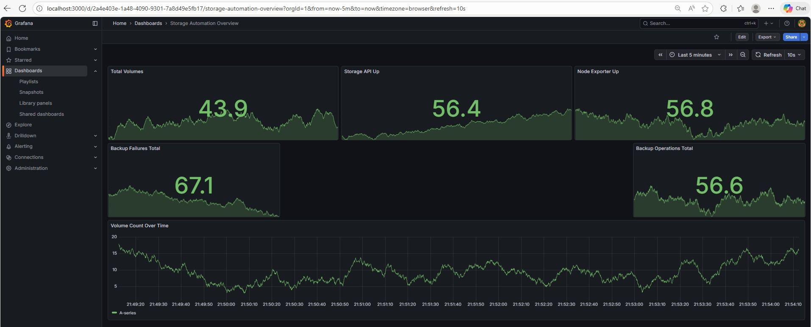
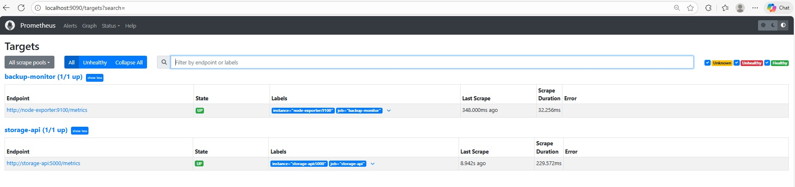
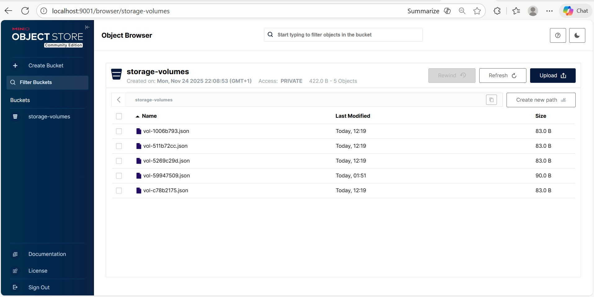

🚀 Infrastructure Automation – Storage & Backup Platform (Simulation Lab)

This repository provides a production-style simulation of an automated storage and backup platform, including provisioning, backups, cleanup automation, monitoring, and lifecycle management (LCM).
Although the environment is a simulation lab, the entire project follows real-world patterns used in enterprise environments:

* API-driven storage provisioning
* Automated backup workflows
* Lifecycle management (LCM) automation
* Monitoring & alerting with Prometheus/Grafana
* Operational automation using Ansible
* Observability & custom metrics exposure
* MinIO (S3-compatible) as persistent storage backend

📦 What This Project Delivers

✔ API-Driven Storage System
A Flask-based REST API that supports:
* Create/Delete volumes
* Trigger backups
* List backups
* Prometheus metrics endpoint (/metrics)
* Health check endpoint (/health)

✔ Persistent Backend Using MinIO
Simulates:
* Metadata storage for volumes (storage-volumes bucket)
* Backup storage (storage-volumes-backup bucket)

✔ Full Automation with Ansible
Includes complete end-to-end workflows:
* Provisioning (storage_provision.yml)
* Backup Automation (backup_trigger.yml)
* Backup Validation (backup_validate.yml)
* Cleanup workflows (cleanup.yml)
* LCM Upgrade Simulation (lcm_upgrade.yml)
* LCM Health Check (lcm_health_check.yml)

✔ Observability Stack (Prometheus + Grafana)
* Prometheus scrapes API metrics
* Grafana dashboard visualizes storage & backup health
* Alerts for:
  * API down
  * Node exporter down
  * Backup failures
  * Missing backups

✔ Full Docker Compose Deployment
Starts the entire environment:
* Storage API
* MinIO
* Prometheus
* Grafana
* Node exporter

🏗 Architecture Overview

The architecture simulates a simplified enterprise storage environment:

```text
┌──────────────────────────────┐
│     Ansible Automation       │
│ (Provision, Backup, LCM Ops) │
└─────────────┬────────────────┘
              │ REST API Calls
┌─────────────▼───────────────┐
│     Python Storage API      │
│  /volumes  /backup  /metrics │
└─────────────┬───────────────┘
              │ S3 Operations
┌─────────────▼───────────────┐
│           MinIO             │
│ storage-volumes / backups    │
└─────────────┬───────────────┘
              │ Metrics scrape
┌─────────────▼───────────────┐
│          Prometheus         │
└─────────────┬───────────────┘
              │ Dashboards
┌─────────────▼───────────────┐
│           Grafana           │
└──────────────────────────────┘

🚀 Quick Start (Full Lab Environment)

This lab runs fully inside Docker using WSL2 or Linux.

1. Start the complete environment
   
   docker compose up -d --build

This launches:
* MinIO
* Storage API
* Prometheus
* Node Exporter
* Grafana

2. Access UI Components
Component	    URL	                     Credentials
Storage API	    http://localhost:5000    —
MinIO Console	http://localhost:9001    minio / minio123
Prometheus	    http://localhost:9090    —
Grafana	        http://localhost:3000    admin / admin

🧪 Automation Workflows (Ansible Playbooks)

Provision a new volume
   ansible-playbook ansible/playbooks/storage_provision.yml

Trigger backups for all volumes
   ansible-playbook ansible/playbooks/backup_trigger.yml

Validate backups exist
   ansible-playbook ansible/playbooks/backup_validate.yml

Delete all test volumes
   ansible-playbook ansible/playbooks/cleanup.yml

Simulate storage-api LCM upgrade
   ansible-playbook ansible/playbooks/lcm_upgrade.yml

Run LCM health check
   ansible-playbook ansible/playbooks/lcm_health_check.yml

📊 Monitoring & Metrics

The Storage API exposes Prometheus metrics:

storage_volumes_total
backup_operations_total
backup_failures_total

Prometheus scrapes:
* storage-api
* node-exporter

Grafana dashboard includes:
* Total volumes
* Backup success/failure counters
* Storage API health status
* Backup operations timeline
* Alerts (API down, backup failures, missing backups)







Dashboard JSON is located at:
   monitoring/grafana/storage_automation_dashboard.json

🕒 Automated Nightly Backups (Cron Example)

To simulate enterprise scheduled backups:

0 23 * * * cd /mnt/.../infra-automation-storage-project && ansible-playbook ansible/playbooks/backup_trigger.yml >> storage_backup_cron.log 2>&1

Validate cron execution via:
* storage_backup_cron.log
* New files in storage-volumes-backup bucket
* /api/v1/backups API (http://localhost:5000/api/v1/backups)
* Updated metrics
* Grafana dashboard