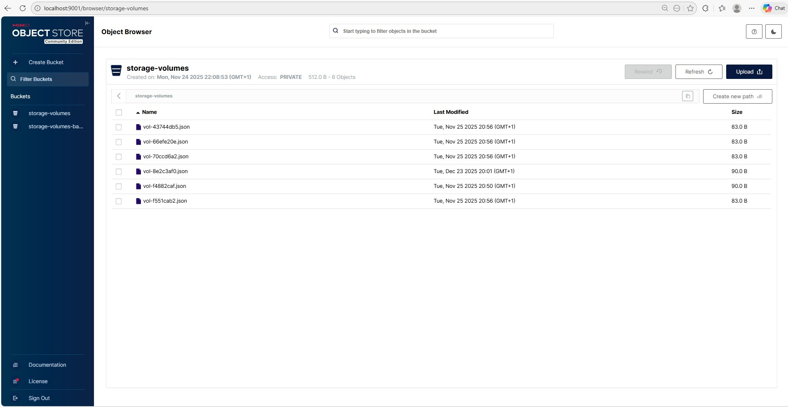
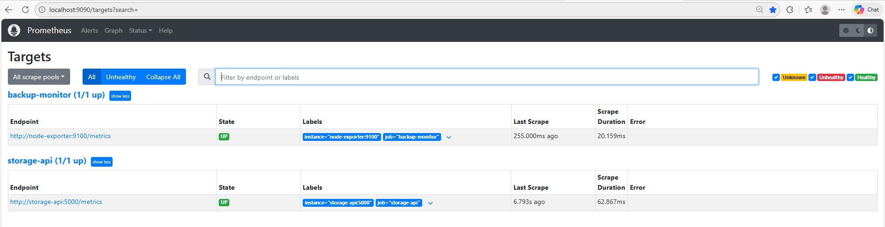
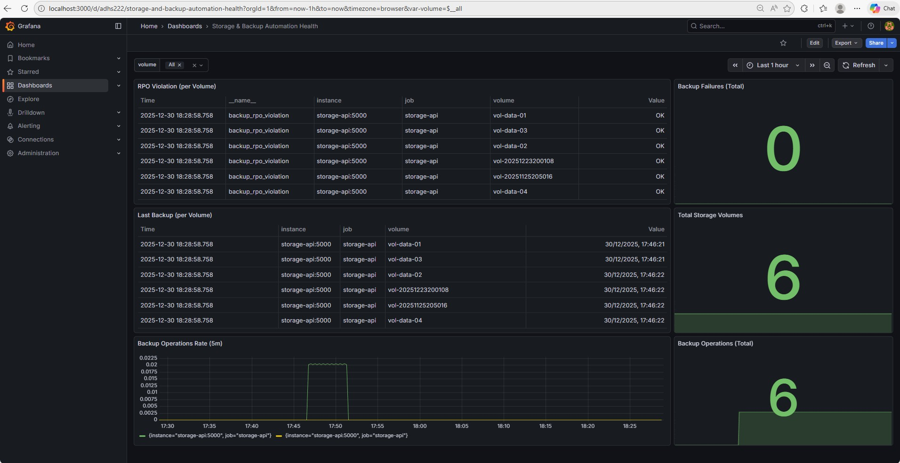

# Infrastructure Automation – Storage & Backup Platform (Simulation Lab)

## Overview

This repository provides a **production-style simulation** of an automated **storage and backup platform**, designed to reflect real-world enterprise and telco-grade operational patterns.

Although implemented as a simulation lab, the architecture, automation flows, monitoring, and alerting mechanisms closely mirror what is commonly found in **large-scale enterprise IT and telecom environments**.

The project demonstrates how **API-driven storage services**, **scheduled backups**, **observability**, and **infrastructure automation** can be designed, operated, and monitored in a consistent and scalable manner.

---

## Key Capabilities

### ✅ API-Driven Storage Service
A Python (Flask)–based REST API that supports:

- Create and delete storage volumes
- Trigger backups per volume or for all volumes
- List backups and volumes
- Expose Prometheus-compatible metrics (`/metrics`)
- Provide health checks (`/health`)

### ✅ Persistent Storage Backend (MinIO – S3 Compatible)
MinIO is used to simulate an object-storage backend:

- Volume metadata stored in a dedicated bucket
- Backup artifacts stored in a backup bucket
- Fully API-driven access, similar to AWS S3 or enterprise object storage



### ✅ Automated Backup Scheduling
A dedicated **backup scheduler container** executes automatic backups using **cron**:

- Daily scheduled backups for all volumes
- Centralized logging of backup execution
- API-driven backup triggers (no direct storage coupling)
- Designed to mimic enterprise backup orchestration services

### ✅ Infrastructure & Operational Automation (Ansible)
The repository includes Ansible playbooks that simulate operational workflows:

- Storage provisioning
- Manual backup triggering
- Backup validation
- Cleanup automation
- Lifecycle Management (LCM) upgrade simulation
- Post-upgrade health checks

### ✅ Observability & Monitoring (Prometheus + Grafana)
The platform exposes custom metrics and provides full observability:

**Prometheus Metrics**
- `storage_volume_count`
- `backup_operations_total`
- `backup_failures_total`
- `backup_last_success_timestamp`
- `backup_rpo_violation`



**Grafana Dashboard**
- RPO violations per volume
- Last successful backup timestamp per volume
- Backup operation rate (5-minute window)
- Total backup operations
- Total storage volumes
- Backup failures overview



All dashboards are built using **real PromQL queries** and production-style visualization patterns.

### ✅ Alerting
Alert rules are defined for operational visibility, including:

- Storage API availability
- Backup failures
- Missing or delayed backups (RPO violations)

### ✅ Security & Access Control 

This project includes a lightweight but realistic security simulation aligned with enterprise practices.

### API Token–Based RBAC
The Storage API implements Role-Based Access Control (RBAC) using API tokens:

| Role  | Allowed Actions |
|-------|-----------------|
| read  | List volumes, list backups |
| backup| Trigger backups |
| admin | Create/delete volumes |

Tokens are provided via HTTP header:

X-API-TOKEN: <token>

Tokens are injected via environment variables:
- ADMIN_TOKEN
- BACKUP_TOKEN
- READ_TOKEN

### Secrets Management
Secrets are not hardcoded in the application logic. In production, these tokens should be stored securely using:
- Docker secrets
- Kubernetes Secrets
- Vault (HashiCorp)

### Transport & Encryption
- HTTPS termination is assumed at ingress / reverse proxy layer
- Backup metadata stored in MinIO (S3-compatible)
- Supports server-side encryption in real deployments

### Observability & Security Monitoring
Security-relevant signals are observable via Prometheus metrics:
- backup_failures_total
- backup_rpo_violation
- API availability via /health

These metrics can be alerted on using Prometheus Alertmanager or Grafana Alerting.

---

## Architecture Overview

```
┌──────────────────────────────┐
│      Automation Layer        │
│   (Ansible / Cron Scheduler) │
└─────────────┬────────────────┘
              │ REST API Calls
┌─────────────▼───────────────┐
│       Storage API            │
│  /volumes /backup /metrics   │
└─────────────┬────────────────┘
              │ S3 Operations
┌─────────────▼───────────────┐
│            MinIO             │
│  Volume Metadata / Backups   │
└─────────────┬────────────────┘
              │ Metrics Scrape
┌─────────────▼───────────────┐
│         Prometheus           │
└─────────────┬────────────────┘
              │ Dashboards
┌─────────────▼───────────────┐
│           Grafana            │
└──────────────────────────────┘
```

---

## Quick Start – Full Lab Deployment

### 1. Start the complete environment

```bash
docker compose up -d --build
```

This will start:

- Storage API
- MinIO
- Backup Scheduler
- Prometheus
- Grafana
- Node Exporter

### 2. Access Components

| Component        | URL                         | Credentials           |
|------------------|-----------------------------|-----------------------|
| Storage API      | http://localhost:5000       | —                     |
| MinIO Console    | http://localhost:9001       | minio / minio123      |
| Prometheus       | http://localhost:9090       | —                     |
| Grafana          | http://localhost:3000       | admin / admin         |

---

## Automation Workflows (Ansible Playbooks)

In addition to the API-driven and scheduled operations, this project includes a set of **Ansible playbooks** that simulate day-to-day operational and lifecycle workflows typically executed by infrastructure or platform teams.

These playbooks demonstrate **repeatable, controlled automation** aligned with enterprise operational practices.

### Available Playbooks

**Provision a new storage volume**
```bash
ansible-playbook ansible/playbooks/storage_provision.yml
```

**Trigger backups for all existing volumes**
```bash
ansible-playbook ansible/playbooks/backup_trigger.yml
```

**Validate backup availability and health**
```bash
ansible-playbook ansible/playbooks/backup_validate.yml
```

**Cleanup test volumes and backup artifacts**
```bash
ansible-playbook ansible/playbooks/cleanup.yml
```

**Simulate a Storage API lifecycle upgrade (LCM)**
```bash
ansible-playbook ansible/playbooks/lcm_upgrade.yml
```

**Run post-upgrade lifecycle health checks**
```bash
ansible-playbook ansible/playbooks/lcm_health_check.yml
```

These workflows illustrate how **configuration management and operational automation** integrate with API-driven platforms and observability systems.

---

## Grafana Dashboard

The Grafana dashboard reflects the **current production state** of the platform and is exported directly from Grafana.

📁 **Dashboard JSON**
```
monitoring/grafana/storage_backup_automation_dashboard.json
```

**Important Note on Time Semantics**
- The **Time** column represents Prometheus scrape time.
- The **Value** column represents the actual timestamp of the last successful backup.

This distinction is intentional and follows Prometheus best practices.

---

## Automated Backup Scheduling

Automatic backups are executed using a cron-based scheduler container.

Example schedule (daily at 18:00):
```cron
0 18 * * * /app/backup_all_volumes.sh >> /var/log/cron.log 2>&1
```

Backup execution can be verified via:

- Scheduler logs (`/var/log/cron.log`)
- Prometheus metrics
- Grafana dashboard
- MinIO backup bucket contents

---

## What This Project Demonstrates

This lab showcases:

- API-first infrastructure design
- Decoupled backup orchestration
- Prometheus metric design and semantics
- Grafana dashboard engineering
- Cron-based scheduling in containerized environments
- Operational automation with Ansible
- Production-style observability and alerting patterns

While simplified for learning purposes, the concepts and implementations align closely with **real enterprise and telco production systems**.

---

## Disclaimer

This project is a **simulation and learning platform**.  
It is not intended for direct production use but is designed to demonstrate architecture, automation, and observability principles used in real-world environments.

👨‍💼 Author

Thomas Waas 

